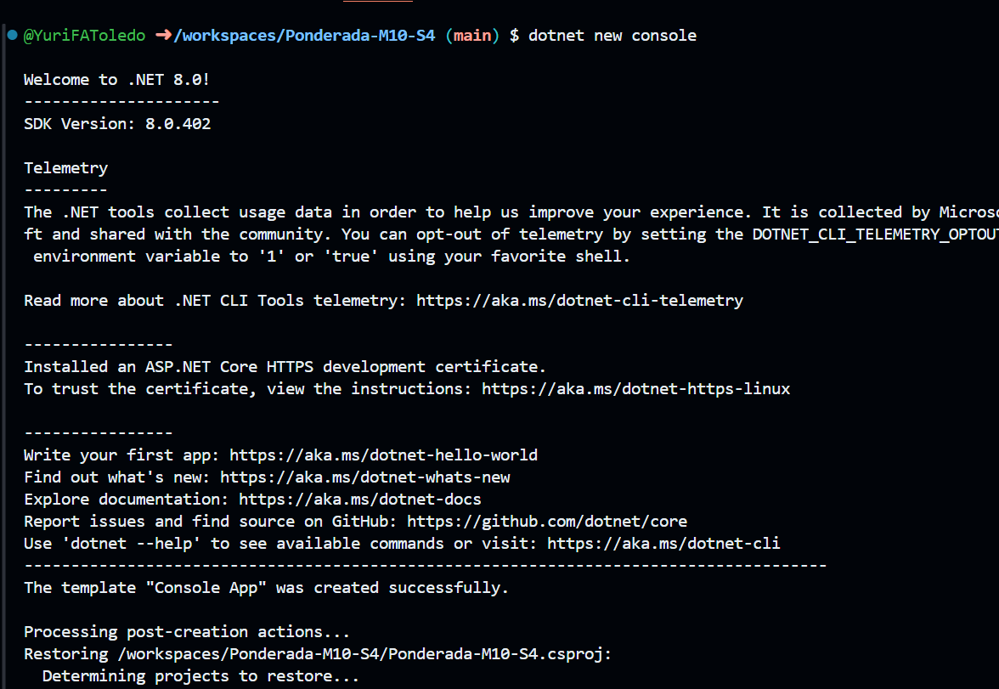
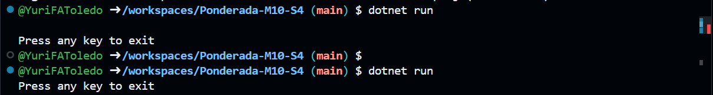
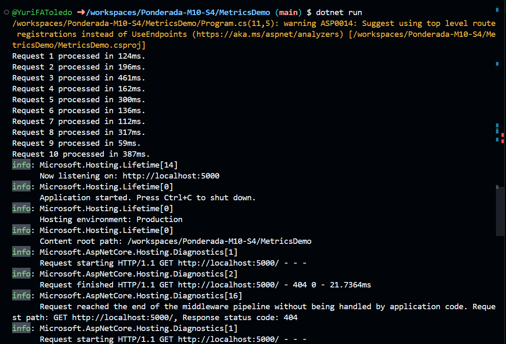

# Ponderada-M10-S4

## Instrumentação de Métricas no .NET Core

### Visão Geral
Este projeto demonstra como instrumentar métricas em aplicativos .NET Core usando a API `System.Diagnostics.Metrics`. O tutorial cobre a criação de métricas personalizadas, instrumentação de aplicativos, e coleta de métricas usando várias ferramentas.

### Pré-requisitos
- .NET Core SDK 3.1 ou superior
- Ferramentas de linha de comando como `dotnet-counters`, `Prometheus` e `Grafana`

### Primeiros Passos
1. **Clone o repositório**:
    ```sh
    git clone <URL_do_repositório>
    cd <nome_do_projeto>
    ```

2. **Crie e configure o projeto**:
    ```sh
    dotnet new console -n MetricsDemo    
    cd MetricsDemo
    dotnet add package System.Diagnostics.DiagnosticSource
    ```

    


3. **Execute a aplicação**:
    ```sh
    dotnet run
    ```


### Instrumentação de Métricas

Nesta seção, criamos um contador para acompanhar o número de solicitações processadas pelo aplicativo.

1. **Adicione o seguinte código ao projeto**:
    ```csharp
    using System;
    using System.Diagnostics.Metrics;

    class Program
    {
        static void Main(string[] args)
        {
            Meter meter = new Meter("MetricsDemo", "1.0");
            Counter<long> requestCounter = meter.CreateCounter<long>("requests");

            for (int i = 0; i < 10; i++)
            {
                requestCounter.Add(1);
                Console.WriteLine($"Request {i + 1} processed.");
            }
        }
    }
    ```

2. **Execute novamente a aplicação** para ver o contador em ação:
    ```sh
    dotnet run
    ```

### Coleta de Métricas

Nesta seção, usaremos a ferramenta `dotnet-counters` para coletar e exibir as métricas instrumentadas pelo aplicativo.

1. **Instale a ferramenta `dotnet-counters`** (se ainda não estiver instalada):
    ```sh
    dotnet tool install --global dotnet-counters
    ```

2. **Execute a aplicação em um terminal separado**:
    ```sh
    dotnet run
    ```

3. **Em outro terminal, colete e exiba as métricas**:
    ```sh
    dotnet-counters monitor --process-id <ID_do_processo>
    ```

    Substitua `<ID_do_processo>` pelo ID do processo da aplicação em execução. Para encontrar o ID do processo, você pode usar o comando:
    ```sh
    dotnet-counters ps
    ```

    Isso exibirá uma lista de processos .NET em execução e seus respectivos IDs.


### Integração com Ferramentas de Monitoramento

Nesta seção, configuramos a coleta de métricas com `Prometheus` e visualização no `Grafana`.

1. **Adicione o pacote `prometheus-net.AspNetCore` ao projeto**:
    ```sh
    dotnet add package prometheus-net.AspNetCore
    ```

2. **Adicione o seguinte código para configurar a coleta de métricas**:
    ```csharp
    using Microsoft.AspNetCore.Builder;
    using Microsoft.Extensions.DependencyInjection;
    using Prometheus;
    using System.Diagnostics.Metrics;

    var builder = WebApplication.CreateBuilder(args);
    var app = builder.Build();

    app.UseRouting();
    app.UseHttpMetrics(); // Adicione esta linha para habilitar a coleta de métricas HTTP
    app.UseEndpoints(endpoints =>
    {
        endpoints.MapMetrics();
    });

    Meter meter = new Meter("MetricsDemo", "1.0");
    Counter<long> requestCounter = meter.CreateCounter<long>("requests");

    for (int i = 0; i < 10; i++)
    {
        requestCounter.Add(1);
        Console.WriteLine($"Request {i + 1} processed.");
    }

    app.Run();
    ```

3. **Execute a aplicação** e verifique se a endpoint de métricas está disponível:
    ```sh
    dotnet run
    ```

    Acesse `http://localhost:5000/metrics` para ver as métricas expostas.

4. **Configuração do Prometheus**:
    Crie um arquivo de configuração `prometheus.yml` com o seguinte conteúdo:
    ```yaml
    global:
      scrape_interval: 15s

    scrape_configs:
      - job_name: 'metrics_demo'
        static_configs:
          - targets: ['host.docker.internal:5000']
    ```

5. **Execute o Prometheus**:
    ```sh
    prometheus --config.file=prometheus.yml
    ```

6. **Configuração do Grafana**:
    - Adicione o Prometheus como fonte de dados no Grafana.
    - Crie dashboards para visualizar as métricas.


### Simulação de Transações e Adição de Métricas Personalizadas

Nesta seção, simulamos transações no aplicativo e adicionamos métricas personalizadas para acompanhar o número de solicitações e os tempos de resposta.

1. **Adicione o seguinte código ao projeto**:
    ```csharp
    using Microsoft.AspNetCore.Builder;
    using Microsoft.Extensions.DependencyInjection;
    using Prometheus;
    using System.Diagnostics.Metrics;

    var builder = WebApplication.CreateBuilder(args);
    var app = builder.Build();

    app.UseRouting();
    app.UseHttpMetrics(); // Adiciona a coleta de métricas HTTP
    app.UseEndpoints(endpoints =>
    {
        endpoints.MapMetrics();
    });

    Meter meter = new Meter("MetricsDemo", "1.0");
    Counter<long> requestCounter = meter.CreateCounter<long>("requests");
    Histogram<float> responseTimeHistogram = meter.CreateHistogram<float>("response_time", "ms");

    Random random = new Random();
    for (int i = 0; i < 10; i++)
    {
        requestCounter.Add(1);
        float responseTime = random.Next(50, 500); // Simula um tempo de resposta entre 50ms e 500ms
        responseTimeHistogram.Record(responseTime);
        Console.WriteLine($"Request {i + 1} processed in {responseTime}ms.");
    }

    app.Run();
    ```

2. **Execute novamente a aplicação**:
    ```sh
    dotnet run
    ```

3. **Verifique as métricas no Prometheus**:
    Acesse `http://localhost:5000/metrics` para ver as métricas expostas. Você verá métricas como `requests` e `response_time`.

4. **Visualize as Métricas no Grafana**:
    No Grafana, crie dashboards para visualizar as novas métricas de tempo de resposta.